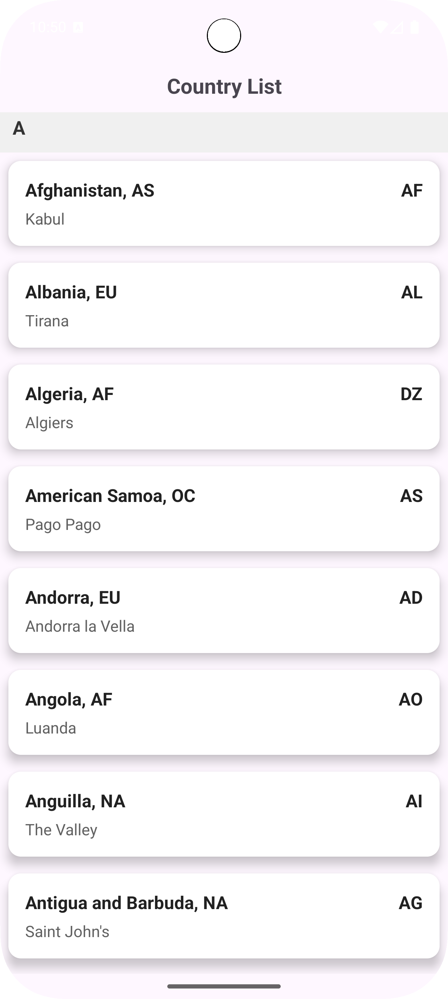

# Country List App 

This is a simple Android app that fetches and displays a list of countries using MVVM architecture, Retrofit, Recycler View, Stateflow/Livedata and ViewBinding.

## Screenshot

<div style="display: flex; gap: 10px;">
  
</div>


## Architecture

- **MVVM**: Clear separation of concerns
- **Repository Pattern**: Handles API interaction
- **ViewModel**: Holds UI data lifecycle-aware
- **LiveData/StateFlow **: Observes data changes
- **RecyclerView**: Displays list of countries

## Features

- Fetches country data from a REST API
- Displays:
  - Country Name
  - Region
  - Code
  - Capital
- Sorted alphabetically
- Modern card UI with clean formatting
- MVVM architecture with LiveData
- Retrofit for API calls
- ViewBinding for cleaner UI code
  

## Tech Stack

| Tech             | Usage                          |
|------------------|--------------------------------|
| Kotlin           | Language                       |
| Retrofit         | Networking                     |
| ViewBinding      | View references                |
| LiveData/Flows   | Observable data holder         |
| RecyclerView     | Display list                   |
| CardView         | UI card elements               |
| Gson             | JSON parsing                   |

## How to Run Project

1. Clone the repo:
   ```bash
   git clone https://github.com/Asante-Adarkwa-Usman/country_list_app.git
